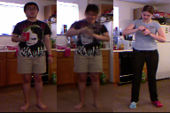
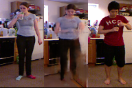
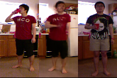
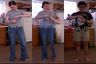

# image-generation

This is Keras implementation of [Deformable GAN](https://arxiv.org/pdf/1801.00055.pdf). It is based on the original implementation [here](https://github.com/AliaksandrSiarohin/pose-gan). The aim of this work is to transfer images: Given two different image A and B, we extract appearance from image A and poses from image B; and combine these two information to generate a third image with appearance of A but poses of B.

This image generation work is part of my master project. And I train the model on [CAD60](http://pr.cs.cornell.edu/humanactivities/data.php). After training on the CAD60, some results are:

each image, the first image is Appearance image, the third image is Pose image, and the middle image is generated image, where it should have the appearance from the first image but pose from the third image.

       --------------------        

      --------------------          

